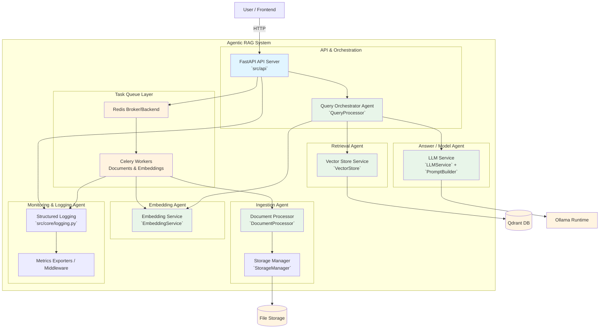
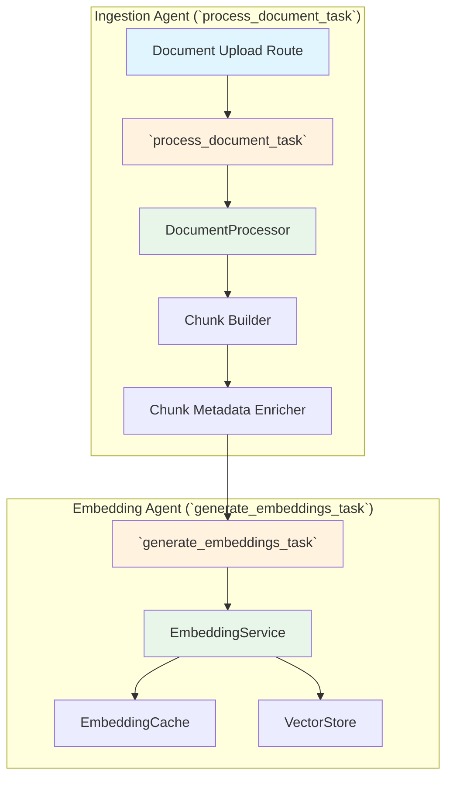
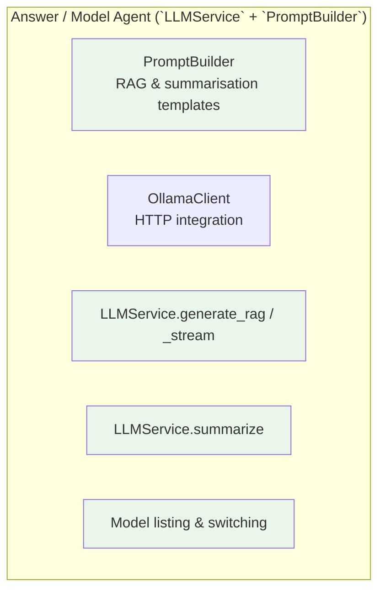
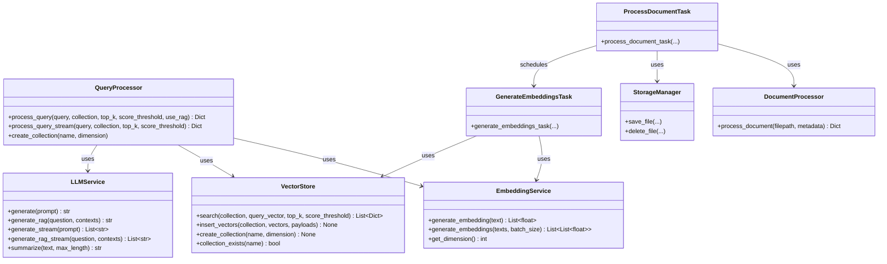

# C4 Model – Agentic RAG System

## Overview

This document extends the base RAG C4 model to cover the **agentic orchestration** used in this project.  
Instead of a single monolithic RAG pipeline, the system is decomposed into cooperating **agents** (specialised services and workers) that coordinate via APIs and task queues.

Agentic in this context means:

- Individual services have **clear goals** (ingest, embed, retrieve, answer, manage models)
- They run **autonomously** once triggered and make **local decisions** (caching, retries, validation)
- They communicate through **well‑defined contracts** (REST APIs, Celery tasks, vector store operations)

Related base documents:

- `rag/01-basic-design.md` – core RAG components
- `rag/02-c4-model.md` – non‑agentic C4 view
- `rag/03-high-level-design.md` – general high‑level architecture

## 1. Context Diagram – Agentic View

From a context point of view, the system is still “one RAG System”, but the **behaviour** is now expressed as agents collaborating to fulfil user intents.

```mermaid
flowchart TB
    User[User / Frontend] -->|Queries, Document actions| AgenticRAG[Agentic RAG API]

    subgraph AgenticRAG[ Agentic RAG System ]
        Orchestrator[Query Orchestrator Agent<br/>(QueryProcessor + LLMService)]
        IngestionAgent[Ingestion Agent<br/>(API + DocumentProcessor + Celery)]
        EmbeddingAgent[Embedding Agent<br/>(EmbeddingService + Celery)]
        RetrievalAgent[Retrieval Agent<br/>(VectorStore)]
        ModelAgent[Model Management Agent<br/>(LLMService / EmbeddingService)]
        MonitoringAgent[Monitoring & Logging Agent]
    end

    AgenticRAG -->|Store & search vectors| Qdrant[Qdrant Vector DB]
    AgenticRAG -->|LLM inference| Ollama[Ollama Runtime]
    AgenticRAG -->|Store documents| FileStore[File Storage]
    AgenticRAG -->|Metrics & logs| Obsv[Prometheus / Loki / Grafana]

    style AgenticRAG fill:#e1f5ff
    style User fill:#f0f0f0
    style Qdrant fill:#fff4e1
    style Ollama fill:#fff4e1
    style FileStore fill:#fff4e1
    style Obsv fill:#fff4e1
```

### External Actors

| Actor | Type | Description |
|-------|------|-------------|
| **User / Frontend** | Person / System | Uses the REST API (and React UI) to upload documents, manage collections, and issue queries |
| **Administrator** | Person | Manages deployment, models, configuration, and monitoring |
| **Qdrant** | System | Vector database storing document embeddings and metadata |
| **Ollama** | System | Local LLM runtime for generation and summarisation |
| **File Storage** | System | Local filesystem or mounted volume for raw documents |
| **Observability Stack** | System | Prometheus, Loki, Grafana for metrics and logs |

## 2. Container Diagram – Agentic Containers

The underlying containers are the same as in the base C4 model, but we now explicitly group them into **agents** with goals and responsibilities.



### Agentic Containers and Responsibilities

| Agent / Container | Backing Code | Responsibilities |
|-------------------|-------------|------------------|
| **API & Orchestration** | `src/api`, `QueryProcessor` | Accepts user intents (upload, query), validates them, and delegates work to specialised agents |
| **Ingestion Agent** | `DocumentProcessor`, `StorageManager`, `document_tasks` | Parses, cleans, chunks, and persists documents; emits embedding jobs |
| **Embedding Agent** | `EmbeddingService`, `embedding_tasks` | Generates and caches embeddings, manages embedding model configuration, ensures collection dimensions match |
| **Retrieval Agent** | `VectorStore` | Manages collections, executes similarity searches, filters by metadata and score |
| **Answer / Model Agent** | `LLMService`, `PromptBuilder`, `OllamaClient` | Builds prompts, calls LLM, streams responses, manages model listing and switching |
| **Task Queue Layer** | `Celery`, `Redis` | Schedules and executes long‑running tasks, handles retries and backoff |
| **Monitoring & Logging Agent** | `src/core/logging.py`, Loki/Prometheus/Grafana | Structured logs, metrics, dashboards, alerting hooks |

## 3. Component Diagram – Orchestrator and Agents

### 3.1 Query Orchestrator Agent

```mermaid
flowchart TB
    subgraph QueryOrchestratorAgent["Query Orchestrator Agent (`QueryProcessor`)"]
        direction TB

        QueryAPI[Query API Route<br/>`src/api/routes/query.py`]
        Validator[QueryValidator<br/>`src/utils/validators.py`]
        Orchestrator[QueryProcessor<br/>`process_query` / `process_query_stream`]
        Retriever[VectorStore Client<br/>`VectorStore.search`]
        Embedder[Embedding Client<br/>`EmbeddingService.generate_embedding`]
        RAGLLM[LLM RAG Wrapper<br/>`LLMService.generate_rag(_stream)`]

        QueryAPI --> Validator
        QueryAPI --> Orchestrator
        Orchestrator --> Embedder
        Orchestrator --> Retriever
        Orchestrator --> RAGLLM
    end

    style QueryAPI fill:#e1f5ff
    style Orchestrator fill:#e8f5e9
```

**Responsibilities:**

- Validate search parameters and query text
- Decide when to:
  - run pure vector search (set `use_rag=False`)
  - perform full RAG (embedding → retrieval → LLM)
- Coordinate streaming vs non‑streaming responses
- Enforce score thresholds and `top_k` limits

### 3.2 Ingestion & Embedding Agents



These agents collaborate asynchronously:

- **Ingestion Agent**: turns raw files into structured, metadata‑rich chunks.
- **Embedding Agent**: ensures those chunks become vectors stored in Qdrant with consistent payloads.

### 3.3 Answer / Model Agent



**Responsibilities:**

- Build prompts from question + contexts using project‑specific templates
- Provide both blocking and streaming generation
- Offer generic summarisation capabilities
- Expose model discovery and switching so admins can “steer” the answering behaviour

## 4. Code Diagram – Mapping Agents to Modules

At the code level the agentic behaviour is composed from existing services and tasks.



### Agent Mapping Summary

- **Query Orchestrator Agent** → `QueryProcessor` + `LLMService` + `VectorStore` + `EmbeddingService`
- **Ingestion Agent** → `DocumentProcessor` + `StorageManager` + `process_document_task`
- **Embedding Agent** → `EmbeddingService` + `generate_embeddings_task`
- **Retrieval Agent** → `VectorStore` (used by both ingestion and query flows)
- **Answer / Model Agent** → `LLMService`, `PromptBuilder`, `OllamaClient`

## 5. Relationship to Base C4 Model

- The **containers and components** are the same as the base RAG system; the **agentic view** is primarily about:
  - clearer **intent‑centric** boundaries (ingest, embed, retrieve, answer, manage)
  - explicit use of **Celery workers as autonomous agents**
  - emphasising **local decision‑making** (caching, retries, validation) as agent responsibilities.
- This document should be read **after** `rag/02-c4-model.md` to understand how the same codebase supports both a traditional RAG pipeline view and an agent‑oriented view of the system.

