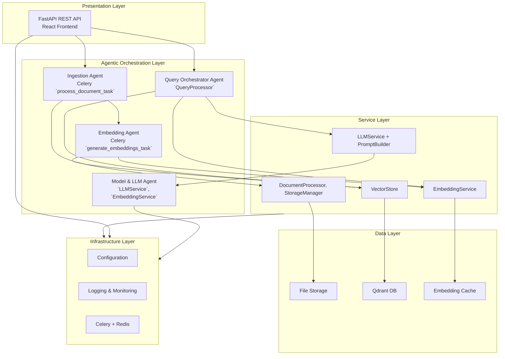
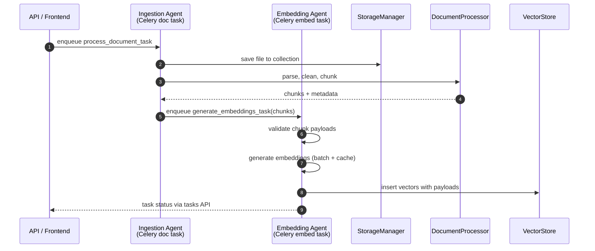
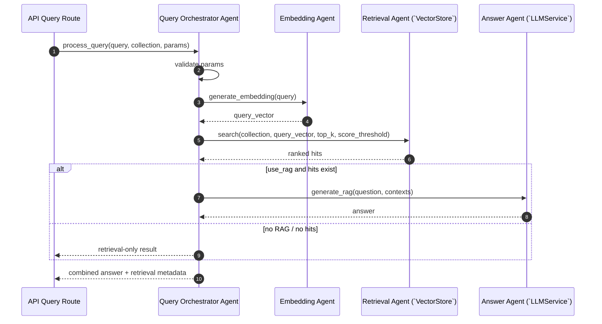
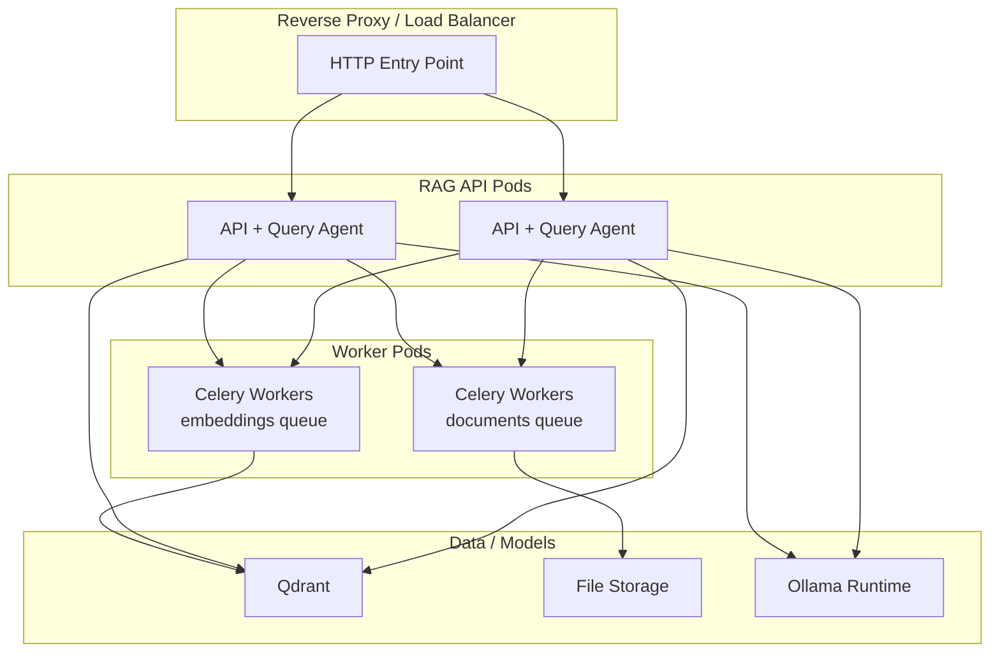

# High-Level Design – Agentic RAG System

## Overview

This document describes the **high-level architecture** of the agentic RAG system, focusing on:

- How the classical layered architecture is extended with **agents**
- How agents collaborate via APIs, task queues, and shared stores
- Key design decisions that enable **autonomy, robustness, and observability**

Read this together with:

- `rag/03-high-level-design.md` – generic RAG high‑level design
- `01-agentic-rag-c4-model.md` – agentic C4 view

## 1. Architectural Style

### 1.1 Layered + Agentic Orchestration

The system keeps the **layered architecture** (Presentation, Service, Data, Infrastructure) but overlays an **agentic orchestration layer** that groups services into goal‑oriented agents.

### 1.2 Agent Roles

- **Query Orchestrator Agent**: Centrally coordinates RAG queries (embedding → retrieval → generation), chooses streaming vs non‑streaming, and enforces thresholds.
- **Ingestion Agent**: Owns the life‑cycle from file upload to chunked, metadata‑rich content ready for embedding.
- **Embedding Agent**: Owns embedding generation, caching, and insertion into Qdrant; makes local decisions about batching and retries.
- **Model & LLM Agent**: Represents and manages models (listing, selection, switching) and prompt construction.

Agents are **logical roles** built from concrete services and Celery tasks. They can be scaled, monitored, and evolved independently.

## 2. Core Agent Designs

### 2.1 Query Orchestrator Agent

- **Goal**: Turn a user’s question + selected collection into a grounded answer (or an informative “no results” response).
- **Key components**:
  - `src/services/query_processor.py` (`QueryProcessor`)
  - `src/services/embedding_service.py` (`EmbeddingService`)
  - `src/services/vector_store.py` (`VectorStore`)
  - `src/services/llm_service.py` (`LLMService`)
  - `src/utils/validators.py` (`QueryValidator`)

**Responsibilities:**

- Interpret user intent from the query and parameters (`top_k`, `score_threshold`, `use_rag`)
- Validate queries and protect the vector and LLM backends from bad input
- Decide whether to:
  - use RAG (embedding → retrieval → LLM)
  - return only retrieval results (`use_rag=False`)
- Annotate and log detailed timing for each step (validation, embedding, search, LLM)

### 2.2 Ingestion Agent

- **Goal**: Transform raw documents into structured, chunked, and enriched content suitable for retrieval.
- **Key components**:
  - `src/tasks/document_tasks.py::process_document_task`
  - `src/services/document_processor.py` (`DocumentProcessor`)
  - `src/services/storage_manager.py` (`StorageManager`)
  - Parsers under `src/parsers/*`

**Responsibilities:**

- Receive ingestion tasks from the API via Celery queues
- Select the appropriate parser (PDF, DOCX, TXT, MD)
- Clean, normalise, and chunk text per configuration
- Attach consistent metadata (document id, filename, collection, chunk index)
- Emit embedding jobs to the Embedding Agent via `generate_embeddings_task`

### 2.3 Embedding Agent

- **Goal**: Maintain high‑quality, cached embeddings and keep Qdrant collections consistent.
- **Key components**:
  - `src/tasks/embedding_tasks.py::generate_embeddings_task`
  - `src/services/embedding_service.py` (`EmbeddingService`)
  - `src/services/vector_store.py` (`VectorStore`)
  - `src/embedding/cache.py` (`EmbeddingCache`)

**Responsibilities:**

- Validate chunk payloads before embedding
- Use `EmbeddingService` to generate embeddings in batches
- Exploit cache hits (single text or batch) to reduce recomputation
- Ensure Qdrant collections exist (create with correct dimension when missing)
- Insert vectors with a rich payload for downstream retrieval and attribution

### 2.4 Model & LLM Agent

- **Goal**: Provide consistent, steerable LLM behaviour (RAG, summarisation) backed by Ollama.
- **Key components**:
  - `src/services/llm_service.py` (`LLMService`)
  - `src/llm/prompt_builder.py` (`PromptBuilder`)
  - `src/llm/ollama_client.py` (`OllamaClient`)

**Responsibilities:**

- Build prompts that follow project‑specific RAG and summarisation templates
- Manage model selection (default vs explicitly configured), including `set_model` and `list_models`
- Provide streaming vs non‑streaming generation for both base prompts and RAG prompts
- Expose summarisation APIs so other agents (like Ingestion or Evaluation) can reuse the same LLM

## 3. Collaboration and Message Flows

### 3.1 Ingestion / Embedding Collaboration

**Design notes:**

- API returns quickly after enqueuing ingestion, making document upload **non‑blocking**.
- Celery workers act as autonomous **background agents** that can be scaled horizontally.

### 3.2 Query / Answer Collaboration

**Design notes:**

- The Query Orchestrator Agent makes a **policy decision** on whether to call the LLM based on `use_rag` and the presence of search results.
- All sub‑steps are instrumented with timing metrics for future optimisation.

## 4. Key Design Decisions

### 4.1 Agentization via Celery and Services

- Agents are implemented as **lightweight compositions** of:
  - HTTP endpoints (for commands / intents)
  - Celery tasks (for asynchronous or long‑running work)
  - Service classes (for encapsulated business logic)
- This keeps the deployment as a **modular monolith** while still supporting:
  - Clear boundaries of responsibility
  - Independent scaling of workers
  - Observability per agent (task queues, logs, metrics)

### 4.2 Strong Validation and Error Boundaries

- Validation is treated as a **first‑class agent responsibility**, particularly for:
  - Query parameters and text length
  - Chunk shapes and payloads
  - Model and collection configuration
- Failures are surfaced via typed exceptions (`ServiceError`, `EmbeddingError`, `LLMError`, etc.), with:
  - Structured logs
  - Retry policies at the Celery level for transient failures

### 4.3 Caching and Idempotency

- The Embedding Agent uses `EmbeddingCache` to:
  - Avoid recomputation of identical texts
  - Make repeated ingestion and re‑chunking more efficient
- Celery tasks are written to be **idempotent where possible**:
  - Insertion of vectors keyed by document and chunk indices
  - Safe re‑creation of collections with the same configuration

### 4.4 Observability as an Agent

- Logging and metrics act as a **Monitoring Agent**:
  - Celery task logs include task IDs, collection names, document IDs, counts, and timings
  - Query logs include query truncations, lengths, and per‑step timing
  - Integration with Loki/Prometheus/Grafana allows dashboards like:
    - “RAG Query Latency”
    - “Embedding Throughput”
    - “Vector Insert Errors”

## 5. Deployment & Scaling (Agentic View)

### 5.1 Logical Deployment

**Scaling strategies:**

- Scale **API pods** for concurrent queries and streaming.
- Scale **document workers** for higher ingestion throughput.
- Scale **embedding workers** for heavy embedding workloads.
- Scale **Qdrant** and **Ollama** independently based on vector and LLM demands.

### 5.2 Resilience

- Celery retries transient failures (network issues, temporary unavailability of Qdrant/Ollama).
- Strict validation ensures that bad inputs fail fast and do not poison downstream agents.
- Clear separation between ingestion, embedding, and query flows means one path can degrade without bringing down the others.

## 6. Future Agentic Extensions

The current implementation already supports agentic behaviour via orchestration and task queues. Future enhancements could introduce additional explicit agents:

- **Planning Agent**: Decomposes complex multi‑step user tasks into a series of RAG queries and tool calls.
- **Post‑processing / Critic Agent**: Evaluates LLM answers for factual consistency and can trigger follow‑up retrieval.
- **Routing Agent**: Chooses between multiple collections, models, or retrieval strategies (e.g., hybrid BM25 + vector).
- **Evaluation Agent**: Periodically samples queries and documents to benchmark and track quality.

These agents would re‑use the same underlying services (`EmbeddingService`, `VectorStore`, `LLMService`) but add higher‑level policies and workflows on top of them.

## 7. Summary

- The agentic RAG design is a **thin but powerful layer** on top of the existing layered architecture.
- Agents are **goal‑oriented compositions** of services and Celery tasks with clear responsibilities and observability.
- This approach keeps deployment simple (modular monolith) while enabling:
  - **Independent scaling** of ingestion vs embedding vs query paths
  - **Robustness** via retries and strict validation
  - **Future extensibility** towards more advanced multi‑agent behaviours.

