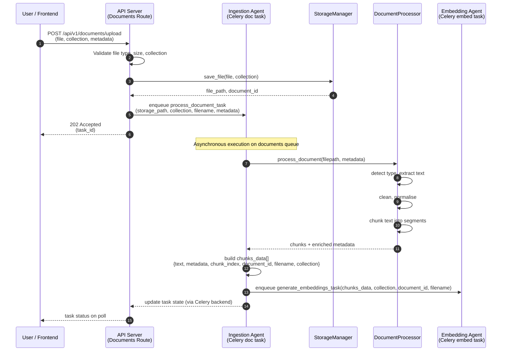
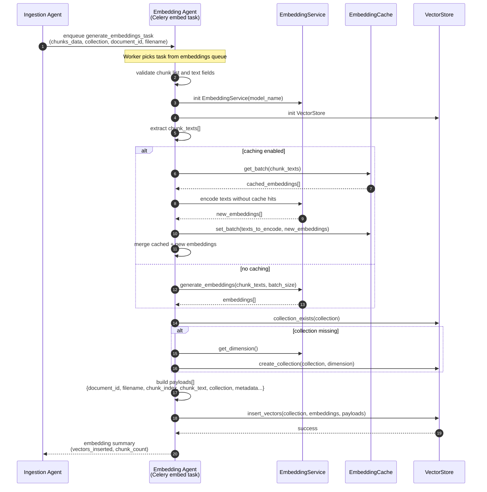
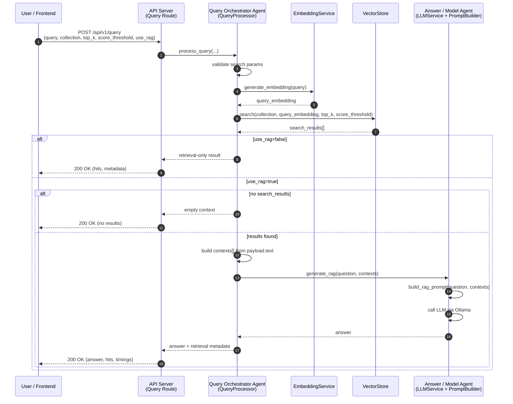
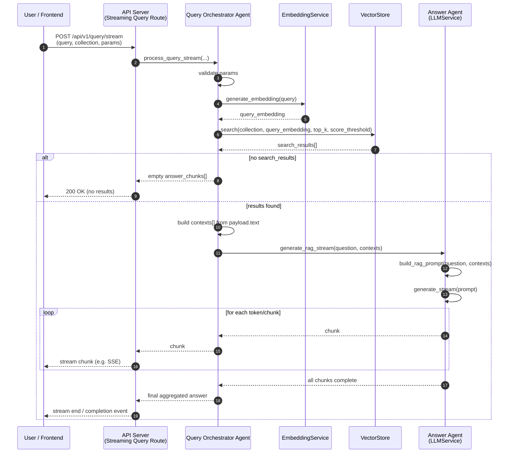
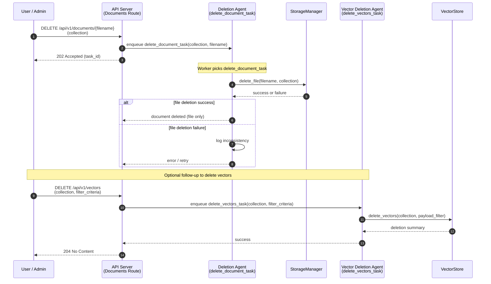
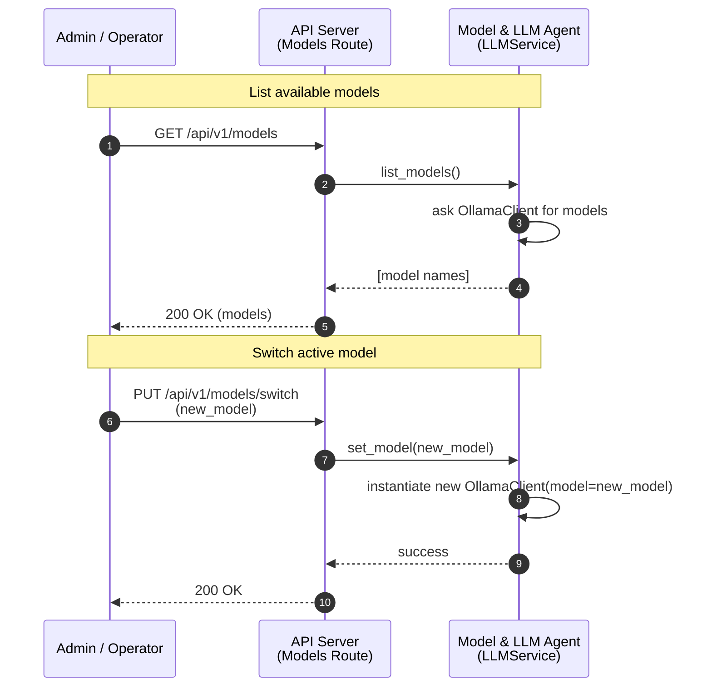

# Sequence Diagrams – Agentic RAG System

## Overview

This document provides **agent‑centric sequence diagrams** for the main flows of the agentic RAG system:

- Document ingestion and preparation
- Embedding generation and storage
- Query and RAG answer generation (non‑streaming and streaming)
- Document deletion and cleanup
- Model management

It builds on the generic sequence diagrams in `rag/05-sequence-diagrams.md`.

---

## 1. Document Ingestion – Agent View

### 1.1 Description

This sequence focuses on how the **Ingestion Agent** turns an uploaded file into structured chunks and triggers the **Embedding Agent**.

### 1.2 Sequence Diagram

### 1.3 Key Agent Behaviours

- **Ingestion Agent** owns parsing, cleaning, chunking and metadata enrichment.
- The ingestion flow is intentionally **decoupled** from embedding via a separate Celery task.

---

## 2. Embedding Generation – Agent View

### 2.1 Description

This sequence highlights the **Embedding Agent** responsibilities: validating chunks, generating embeddings, using cache, and inserting vectors into Qdrant.

### 2.2 Sequence Diagram

### 2.3 Key Agent Behaviours

- **Embedding Agent** ensures:
  - Embedding generation is efficient (batching + caching).
  - Qdrant collections are created with the correct dimension.
  - Metadata payloads are consistent and rich enough for later retrieval and attribution.

---

## 3. Agentic RAG Query – Non‑Streaming

### 3.1 Description

This sequence covers the standard **RAG path** from query to final answer, focusing on the **Query Orchestrator Agent** and **Answer Agent**.

### 3.2 Sequence Diagram

### 3.3 Key Agent Behaviours

- **Query Orchestrator Agent**:
  - Centrally decides when to perform RAG vs. retrieval‑only.
  - Logs and measures each step (validation, embedding, search, LLM).
- **Answer Agent**:
  - Encapsulates RAG prompt construction and model interaction.

---

## 4. Agentic RAG Query – Streaming

### 4.1 Description

This sequence shows how the same agents support **streaming answers**, returning answer chunks as soon as they are produced by the LLM.

### 4.2 Sequence Diagram

### 4.3 Key Agent Behaviours

- Reuses the same retrieval logic but:
  - Wraps LLM calls in a **streaming** interface.
  - Allows frontends to start rendering the answer while generation continues.

---

## 5. Document Deletion – Agent View

### 5.1 Description

This sequence shows how document deletion is handled asynchronously by agents to clean up both file storage and vector store entries.

### 5.2 Sequence Diagram

### 5.3 Key Agent Behaviours

- Separates **file deletion** from **vector deletion** to avoid tight coupling and allow different retry strategies.
- Both deletion operations are fully asynchronous, keeping the user‑facing deletion endpoint responsive.

---

## 6. Model Management – Agent View

### 6.1 Description

This sequence focuses on the **Model & LLM Agent**, illustrating how models are listed and switched.

### 6.2 Sequence Diagram

### 6.3 Key Agent Behaviours

- Encapsulates model management behind `LLMService`, keeping the rest of the system agnostic to specific model details.
- Allows operators to **steer** system behaviour (quality, latency, cost) without changing application code.

---

## 7. Summary

- The sequence diagrams in this document emphasise **agents** rather than just classes or services.
- Each flow (ingestion, embedding, query, deletion, model management) is handled by a **dedicated agent** or a small set of collaborating agents.
- This agentic structure makes the system:
  - Easier to reason about for operations and debugging
  - Straightforward to scale and observe
  - Ready for future extension with additional higher‑level agents (planning, evaluation, routing) built on the same foundations.

