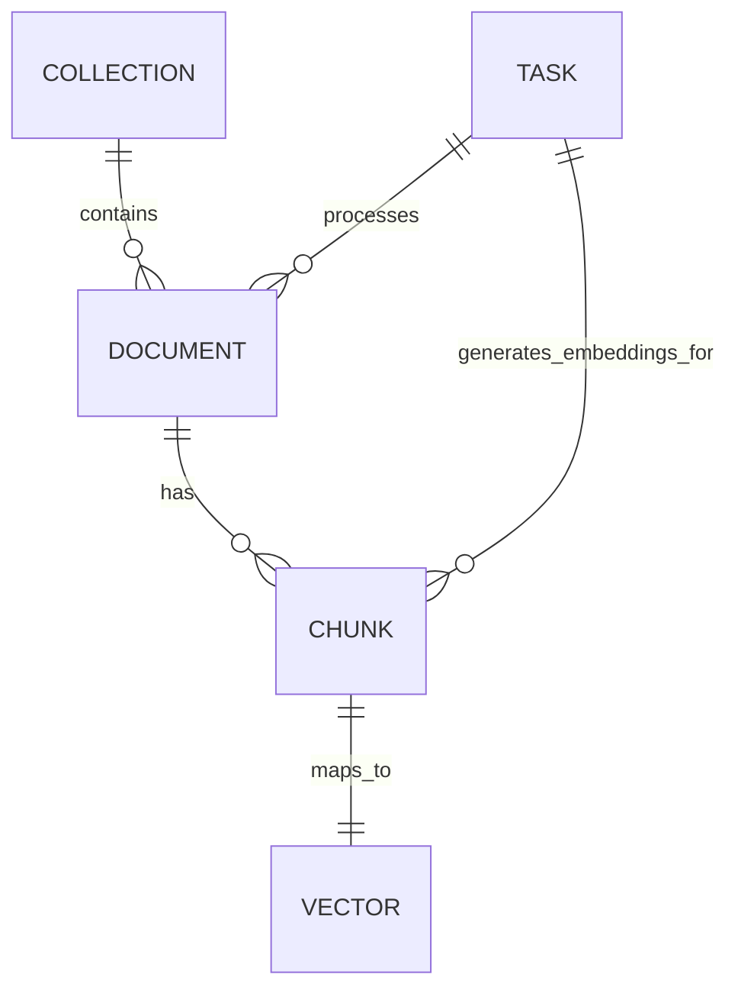

## Data Models & Schemas – Agentic RAG System

### 1. Overview

This document describes the **core data models and schemas** used across the agentic RAG system.
It connects the conceptual entities in the architecture docs to the concrete Pydantic models
and Qdrant payloads in the codebase.

It focuses on:

- **Document & chunk models** used during ingestion and retrieval
- **Vector & collection models** used in Qdrant
- **Task models** representing Celery task status
- **API request/response schemas** for the main flows
- **Entity relationships** between these models

---

### 2. Core Entities

#### 2.1 Document

Logical document as seen by the ingestion and API layers.

- **Key fields** (conceptual):
  - `document_id`: stable identifier for the document
  - `filename`: original filename
  - `collection`: logical collection name
  - `metadata`: arbitrary document-level metadata (author, tags, etc.)
  - `uploaded_at`: upload timestamp
  - `chunk_count`: number of chunks created from the document

- **Concrete API model**
  - Defined in `src/api/models/document.py` as `DocumentResponse`
  - Exposed via document-related routes (upload, list, detail)

#### 2.2 Document Chunk

Represents a chunk of text derived from a document during ingestion.

- **Key fields** (conceptual):
  - `id`: chunk identifier (often maps to Qdrant point id)
  - `text`: the chunk text
  - `metadata`: chunk-level metadata including:
    - `document_id`
    - `filename`
    - `collection`
    - `chunk_index`
    - optional user metadata (tags, labels, etc.)

- **Concrete API model**
  - Defined in `src/api/models/document.py` as `DocumentChunk`
  - Returned in `DocumentChunkResponse`

#### 2.3 Vector (Qdrant Point)

Represents an embedding vector stored in Qdrant.

- **Key fields**:
  - `id`: Qdrant point ID (UUID in this implementation)
  - `vector`: embedding values (`List[float]`)
  - `payload`: arbitrary metadata payload attached to the point

- **Concrete representation**
  - Constructed in `src/services/vector_store.py` as `qdrant_models.PointStruct`
  - Stored and retrieved via `VectorStore.insert_vectors` and `VectorStore.search`

#### 2.4 Collection

Represents a Qdrant collection that groups related vectors.

- **Key fields**:
  - `name`: collection name
  - `dimension`: embedding dimension
  - `vector_count`: number of stored vectors
  - `status`: collection status (from Qdrant)
  - `indexed`: number of indexed vectors

- **Concrete representation**
  - Exposed by `VectorStore.get_collection_info`
  - Listed via `VectorStore.list_collections`

#### 2.5 Task

Represents the state of a Celery task (ingestion, embedding, deletion, etc.).

- **Key fields**:
  - `task_id`: Celery task identifier
  - `task_name`: task function name (e.g. `process_document_task`)
  - `status`: lifecycle state (`PENDING`, `STARTED`, `SUCCESS`, `FAILURE`, etc.)
  - `result`: structured result when completed (document/embedding summary)
  - `error`, `traceback`: diagnostic information on failure
  - `created_at`, `started_at`, `completed_at`
  - `progress`: optional progress indicator (0.0–1.0)
  - `metadata`: additional task metadata (filename, collection, etc.)

- **Concrete API models**
  - `TaskStatus`, `TaskResponse`, `TaskListResponse`
  - Defined in `src/api/models/task.py`

---

### 3. Entity Relationship Diagram

The following diagram shows the relationships between logical entities.

- **COLLECTION → DOCUMENT**: a collection may contain many documents
- **DOCUMENT → CHUNK**: a document is split into multiple chunks
- **CHUNK → VECTOR**: each chunk corresponds to exactly one vector in Qdrant
- **TASK → DOCUMENT / CHUNK**: tasks process documents and produce chunks/embeddings

---

### 4. Qdrant Payload Schema

The vector store attaches a **payload dictionary** to each Qdrant point.
This payload is the main bridge between ingestion, retrieval, and the answer agent.

#### 4.1 Conceptual Payload Fields

Recommended payload structure per chunk:

- `document_id`: stable ID of the source document
- `filename`: original filename
- `collection`: collection name
- `chunk_index`: index of the chunk within the document
- `chunk_text`: original chunk text (or a truncated version)
- `metadata`: any extra metadata (user tags, categories, etc.)

#### 4.2 Usage in Code

- Payloads are assembled in the **Embedding Agent**:
  - In `generate_embeddings_task` (see `src/tasks/embedding_tasks.py`)
  - Then passed into `VectorStore.insert_vectors` as a list of dicts
- Search results returned from Qdrant include this payload:
  - `VectorStore.search` formats each result as:
    - `{"id": ..., "score": ..., "payload": ..., "vector": ...}`
  - The **Query Orchestrator Agent** reads `payload["text"]` / `payload["chunk_text"]`
    as context for RAG prompts.

When extending payloads, keep them **backwards compatible** and ensure
the retrieval logic uses the correct keys.

---

### 5. API Schemas – Main Flows

This section maps high-level flows to concrete API models.

#### 5.1 Document Ingestion

- **Request**: `DocumentUploadRequest` (`src/api/models/document.py`)
  - `collection: str`
  - `chunk_size: Optional[int]`
  - `chunk_overlap: Optional[int]`
  - `chunker_type: Optional[str]`
  - `metadata: Optional[dict]`

- **Response (async upload)**: `DocumentUploadTaskResponse`
  - `task_id`, `document_id`, `filename`, `collection`
  - `status`, `message`, `created_at`

- **Response (document info)**: `DocumentResponse`
  - `document_id`, `filename`, `collection`
  - `chunk_count`, `uploaded_at`, `metadata`

#### 5.2 Query & RAG

- **Request**: `QueryRequest` (`src/api/models/query.py`)
  - `query: str`
  - `collection: str`
  - `top_k: int`
  - `score_threshold: float`
  - `use_rag: bool`
  - `stream: bool`

- **Retrieved document representation**: `RetrievedDocument`
  - `id`, `score`, `text`, `metadata`

- **Response**: `QueryResponse`
  - `query`, `answer`, `answer_chunks`
  - `retrieved_documents`, `retrieval_count`
  - `collection`, `top_k`, `score_threshold`, `use_rag`
  - `timestamp`

#### 5.3 Task Status

- **Task detail**: `TaskResponse`
  - Task lifecycle and result metadata
- **Task list**: `TaskListResponse`

---

### 6. Agent Mapping to Data Models

Each agent uses a subset of the core entities:

- **Ingestion Agent**
  - Input: `DocumentUploadRequest`
  - Output: list of **chunk descriptors** → payloads for `VectorStore`
  - Result summary: stored in `TaskResponse.result`

- **Embedding Agent**
  - Input: `chunks_data` (document/chunk metadata + text)
  - Output: vectors + Qdrant payloads

- **Query Orchestrator Agent**
  - Input: `QueryRequest`
  - Output: `QueryResponse` with `RetrievedDocument` models

- **Answer / Model Agent**
  - Input: question text + contexts extracted from Qdrant payloads
  - Output: `answer` / `answer_chunks` fields in `QueryResponse`

Understanding these mappings makes it easier to:

- Add new metadata fields while maintaining compatibility
- Debug issues across ingestion, embedding, and retrieval
- Design new agents that reuse the same data contracts

