## Configuration Architecture – Agentic RAG System

### 1. Overview

This document describes how configuration is managed across the agentic RAG system and
how agents consume configuration to make local decisions (chunking, model selection,
timeouts, queue behaviour, etc.).

Configuration is centralised in `src/core/config.py` using Pydantic `BaseSettings`
classes and exposed via a single `get_config()` entrypoint.

---

### 2. Configuration Hierarchy

Configuration values are resolved in the following order:

1. **Defaults in code** (`BaseSettings` field defaults)
2. **Environment variables** (e.g. `APP_APP_ENV`, `QDRANT_URL`, `OLLAMA_MODEL`)
3. (Optional) **`.env` file** values loaded by Pydantic

At runtime, services and agents call `get_config()` to obtain a singleton `Config`
instance, which aggregates:

- `AppConfig` – application-level settings
- `QdrantConfig` – vector store settings
- `OllamaConfig` – LLM settings
- `EmbeddingConfig` – embedding model + batch size + cache flag
- `DocumentConfig` – document size/format and chunking settings
- `StorageConfig` – file and cache paths
- `LoggingConfig` – logging level/format
- `SecurityConfig` – auth and rate limiting
- `CeleryConfig` – task queue behaviour

---

### 3. Configuration Flow

The following diagram shows how configuration flows from sources into agents:

```mermaid
flowchart LR
    subgraph sources[ConfigurationSources]
        env[EnvironmentVariables]
        envFile[DotEnvFile]
    end

    subgraph configManager[ConfigManager]
        appCfg[AppConfig]
        qdrantCfg[QdrantConfig]
        ollamaCfg[OllamaConfig]
        embedCfg[EmbeddingConfig]
        docCfg[DocumentConfig]
        storageCfg[StorageConfig]
        loggingCfg[LoggingConfig]
        securityCfg[SecurityConfig]
        celeryCfg[CeleryConfig]
    end

    subgraph agents[AgentConfigs]
        ingestAgentCfg[IngestionAgent]
        embedAgentCfg[EmbeddingAgent]
        queryAgentCfg[QueryAgent]
        answerAgentCfg[AnswerAgent]
        monitorAgentCfg[MonitoringAgent]
    end

    sources --> configManager
    configManager --> agents
```

Key points:

- `Config` is created once via `get_config()` and cached with `lru_cache()`.
- All services/agents **must** fetch configuration via `get_config()` to ensure consistency.
- Agents read only the sections they need (e.g. Embedding Agent reads `embedding`, `storage`).

---

### 4. Configuration Categories

#### 4.1 Model Configuration (LLM & Embeddings)

From `EmbeddingConfig` and `OllamaConfig`:

- **Embedding model**:
  - `EMBEDDING_MODEL_NAME` – Granite embedding model ID
  - `EMBEDDING_BATCH_SIZE` – batch size for `EmbeddingService.generate_embeddings`
  - `EMBEDDING_CACHE_ENABLED` – toggle `EmbeddingCache`
- **LLM model**:
  - `OLLAMA_URL` – Ollama base URL
  - `OLLAMA_MODEL` – default model name
  - `OLLAMA_TIMEOUT` – request timeout
  - `OLLAMA_TEMPERATURE`, `OLLAMA_MAX_TOKENS` – generation parameters

Agents using these:

- **Embedding Agent**: configures batching and caching.
- **Model & LLM Agent**: configures default model and generation behaviour.

#### 4.2 Storage Configuration

From `StorageConfig`:

- `STORAGE_STORAGE_PATH` – root directory for persisted documents
- `STORAGE_MODEL_CACHE_PATH` – model cache location
- `STORAGE_CACHE_PATH` – general cache directory (used by `EmbeddingCache`)
- `STORAGE_LOG_PATH` – log directory

Used by:

- `StorageManager` for raw document storage.
- `EmbeddingCache` for embedding cache files.
- Logging configuration for log file locations (when file handlers are enabled).

#### 4.3 Queue & Worker Configuration (Celery)

From `CeleryConfig`:

- **Broker & backend**:
  - `CELERY_BROKER_URL`
  - `CELERY_RESULT_BACKEND`
- **Serializers & content negotiation**:
  - `CELERY_TASK_SERIALIZER`
  - `CELERY_RESULT_SERIALIZER`
  - `CELERY_ACCEPT_CONTENT` (parsed via `accept_content_raw`)
- **Execution behaviour**:
  - `CELERY_TASK_TIME_LIMIT`, `CELERY_TASK_SOFT_TIME_LIMIT`
  - `CELERY_WORKER_PREFETCH_MULTIPLIER`
  - `CELERY_WORKER_MAX_TASKS_PER_CHILD`
  - `CELERY_WORKER_POOL` (e.g. `solo` for ML safety)

These control how **Ingestion** and **Embedding** agents behave under load and failure.

#### 4.4 Cache Configuration

Combines:

- `EmbeddingConfig.cache_enabled`
- `EmbeddingConfig.batch_size`
- `StorageConfig.cache_path`

These affect:

- Whether embedding cache is used (`EmbeddingService(use_cache=True|False)`).
- Where `EmbeddingCache` stores its JSON file.
- LRU capacity and auto-save behaviour (configured in code, see `EmbeddingCache.__init__`).

#### 4.5 Monitoring & Logging

From `LoggingConfig` and parts of other configs:

- `LOG_LEVEL` – global log level (`DEBUG`, `INFO`, etc.)
- `LOG_FORMAT` – `json` vs `text`

Used by:

- `src/core/logging.py` to configure the logging pipeline.
- Observability stack (Loki / Prometheus / Grafana) consumes these logs and metrics.

---

### 5. Agent-Specific Configuration Usage

#### 5.1 Ingestion Agent

Reads:

- `DocumentConfig` – `max_size`, `chunk_size`, `chunk_overlap`, `supported_formats`
- `StorageConfig` – where to store files
- `CeleryConfig` – worker time limits and queue behaviour

Behaviour examples:

- Rejects documents larger than `max_size`.
- Uses default chunking parameters when not overridden by `DocumentUploadRequest`.

#### 5.2 Embedding Agent

Reads:

- `EmbeddingConfig` – `model_name`, `batch_size`, `cache_enabled`
- `StorageConfig` – `cache_path`
- `QdrantConfig` – Qdrant URL/API key/timeout
- `CeleryConfig` – time limits, prefetch, pool

Behaviour examples:

- Adjusts embedding batch size to balance throughput and memory.
- Enables/disables `EmbeddingCache` based on `cache_enabled`.

#### 5.3 Query Orchestrator & Answer Agent

Read:

- `EmbeddingConfig` – embedding model and cache for query embeddings.
- `OllamaConfig` – LLM endpoint, model, and generation settings.
- `AppConfig` – environment flags (`development`, `production`) that may influence defaults.

Behaviour examples:

- Enforce reasonable `top_k` / `score_threshold` defaults aligned with environment.
- Adjust timeouts for production vs development.

---

### 6. Best Practices for Adding Configuration

When extending the system with new configurable behaviour:

- **Define a new field** in the appropriate `*Config` class in `src/core/config.py`.
- Make the default **safe and conservative**.
- Use clear and consistent env var names (e.g. `NEW_FEATURE_ENABLED` with prefix).
- Access it only via `get_config()` inside services/agents.
- Document it in this file and in the user-facing `README.md` if relevant.

This keeps configuration **discoverable**, **type-safe**, and consistent across agents.

