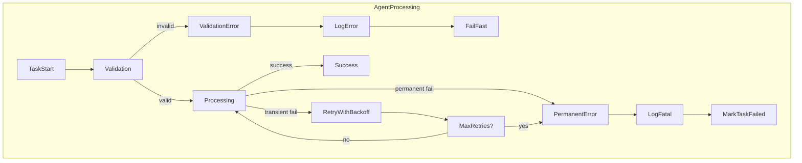

## Error Handling & Resilience Patterns – Agentic RAG System

### 1. Overview

This document describes how **errors, retries, and failures** are handled across
the agentic RAG system. It ties together:

- The custom exception hierarchy in `src/core/exceptions.py`
- How agents surface and classify failures
- How Celery retries and task states are used
- How observability (logging/metrics) supports diagnosis

---

### 2. Error Classification Hierarchy

All custom exceptions derive from `BaseRAGException`, which provides:

- `message`: human-readable message
- `error_code`: machine-friendly code (defaults to class name)
- `details`: structured key/value metadata

Key categories (see `src/core/exceptions.py`):

- **Configuration**
  - `ConfigurationError`, `EnvironmentVariableError`
- **Document Processing**
  - `DocumentProcessingError`
  - `DocumentValidationError`, `DocumentSizeError`, `DocumentFormatError`
  - `DocumentParseError`, `ChunkingError`
- **Embedding**
  - `EmbeddingError`
  - `EmbeddingModelNotFoundError`
  - `EmbeddingGenerationError`
  - `EmbeddingCacheError`
- **Vector Store**
  - `VectorStoreError`
  - `CollectionNotFoundError`, `CollectionCreationError`
  - `VectorInsertionError`, `VectorSearchError`
  - `VectorStoreConnectionError`
- **LLM**
  - `LLMError`
  - `LLMConnectionError`, `LLMGenerationError`, `LLMModelNotFoundError`
  - `PromptError`
- **API**
  - `APIError`
  - `ResourceNotFoundError`, `BadRequestError`, `ValidationError`
  - `UnauthorizedError`, `ForbiddenError`, `RateLimitExceededError`
- **Storage**
  - `StorageError`
  - `FileStorageError`
  - `FileNotFoundError`, `FileUploadError`, `FileDeletionError`
- **Parser**
  - `ParserError`, `UnsupportedParserError`
- **Service**
  - `ServiceError`
  - `ServiceUnavailableError`, `ServiceTimeoutError`

HTTP status codes are derived via `get_http_status_code(exception)`.

---

### 3. Error Flow within Agents

Agents treat **validation failures**, **transient backend errors**, and
**permanent failures** differently.

- **Validation errors**:
  - Thrown early (`DocumentValidationError`, `ValidationError`, etc.).
  - Not retried; mapped directly to 4xx HTTP responses or permanent task failure.
- **Transient errors**:
  - Backend outages, timeouts, connection resets.
  - Mapped to `ServiceUnavailableError`, `VectorStoreConnectionError`, `LLMConnectionError`, etc.
  - Eligible for Celery retries with backoff.
- **Permanent errors**:
  - Corrupted input, non-existent collections, unsupported formats.
  - Marked as `FAILURE` and surfaced with detailed `details`.

---

### 4. Retry Strategies per Agent

While Celery configuration is centralised, each task/agent chooses when and how to retry.

#### 4.1 Ingestion Agent

Typical error sources:

- File not found at storage path
- Unsupported file format
- Parser failures

Strategies:

- **Validation / format errors**:
  - Raise `DocumentFormatError` / `DocumentValidationError`
  - Mark task as failed **without retry**
- **Transient storage issues**:
  - Wrap in `FileStorageError` or `ServiceUnavailableError`
  - Configure limited retries with exponential backoff

#### 4.2 Embedding Agent

Typical error sources:

- Model loading failures
- Timeout talking to the embedding model
- Qdrant unavailability during insert

Strategies:

- **Model not found**:
  - Raise `EmbeddingModelNotFoundError`, fail without retry.
- **Generation failure / timeout**:
  - Wrap in `EmbeddingGenerationError` or `ServiceTimeoutError`.
  - Retry a small number of times with backoff.
- **Qdrant write failure**:
  - Wrap in `VectorInsertionError` / `VectorStoreConnectionError`.
  - Retry writes when failure is clearly transient (connection issues).

#### 4.3 Query Orchestrator & Answer Agent

Typical error sources:

- Qdrant search failures
- LLM generation problems

Strategies:

- **Vector search errors**:
  - Wrap in `VectorSearchError`.
  - May be retried once or downgraded to a user-visible error response.
- **LLM failures**:
  - `LLMConnectionError` for connectivity/timeout.
  - `LLMGenerationError` / `PromptError` for logic issues.
  - Surface as 5xx with a user-friendly message and error code.

---

### 5. Task Status & Error Surfacing

Celery task status is mapped to `TaskResponse` (`src/api/models/task.py`):

- `status`: `PENDING`, `STARTED`, `SUCCESS`, `FAILURE`, `RETRY`, `REVOKED`
- `result`: structured dict for successful tasks
- `error`: error message when failed
- `traceback`: optional traceback (for debugging)
- `metadata`: contextual info (collection, filename, counts)

Guidelines:

- On **success**:
  - Fill `result` with summary data (e.g. `chunk_count`, `vectors_inserted`).
  - Add relevant metadata (collection, document_id).
- On **failure**:
  - Store `exception.to_dict()` in `result` or `metadata` for structured inspection.
  - Preserve `error` string for quick readability.

---

### 6. Observability Integration

Error handling is tightly integrated with logging and metrics:

- **Structured logs**:
  - Always log at appropriate levels:
    - `warning` for recoverable issues and retries
    - `error` for final task failures
  - Include fields:
    - `agent`, `task_name`, `task_id`
    - `collection`, `document_id`, `chunk_count`
    - `error_code`, `error_type`
- **Metrics**:
  - Error counters per agent/task type (e.g. `embedding_task_failures_total`).
  - Retry counters and histograms (e.g. `vector_store_retry_count`).
  - Alerting thresholds for repeated failures or unavailability of Qdrant/Ollama.

This operational view turns each agent into a **self-monitoring component** that
surfacing its own health and failure patterns.

---

### 7. Best Practices for New Code

When adding new services or agents:

- Prefer raising **specific exceptions** from `src/core/exceptions.py`.
- Populate `details` with structured context (ids, counts, config).
- Map to HTTP status via `get_http_status_code` in API layer.
- Decide explicitly if failures are:
  - **Validation** (fast fail, no retry)
  - **Transient** (retry with backoff)
  - **Permanent** (mark failed, log clearly)

This ensures consistent, predictable behaviour across the whole agentic RAG system.

## Caching Architecture – Agentic RAG System

