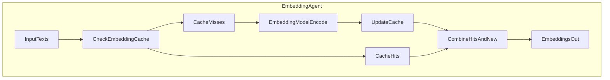

## Caching Architecture – Agentic RAG System

### 1. Overview

Caching is critical to the performance and cost-effectiveness of the agentic RAG system.
This document describes:

- The **EmbeddingCache** used to avoid recomputing embeddings
- Where caching is applied in the RAG flow
- Cache invalidation strategies and configuration
- How to reason about cache hit rates and performance

The primary implementation lives in `src/embedding/cache.py` and is
consumed by `EmbeddingService` in `src/services/embedding_service.py`.

---

### 2. Cache Layers

Current implementation focuses on **embedding caching**:

- **EmbeddingCache** (text → vector)
  - LRU cache with JSON persistence on disk.
  - Used for both single-text and batch embedding operations.

Additional caches that can be added (design-level):

- **LLM response cache** (prompt → answer)
  - For idempotent summarisation or FAQ-style queries.
- **Collection metadata cache**
  - For frequently accessed collection stats (dimension, vector counts).
- **Query result cache**
  - For repeated analytical queries over the same collections.

This document focuses on the **EmbeddingCache**, which is implemented today.

---

### 3. EmbeddingCache Design

`EmbeddingCache` (`src/embedding/cache.py`) provides:

- In-memory **LRU** cache using `OrderedDict`
- Optional on-disk persistence to `embeddings_cache.json`
- Basic statistics: hits, misses, operation times

Key attributes:

- `cache_dir`: directory for cache file (`StorageConfig.cache_path`)
- `cache_file`: JSON file (`embeddings_cache.json`)
- `enabled`: toggle for caching
- `max_size`: max entries before LRU eviction
- `auto_save_interval`: number of writes before auto-save

Embeddings are keyed by **SHA-256 hash of the text**, so raw text
never appears in the cache file itself.

---

### 4. Embedding Flow with Cache

The Embedding Agent uses `EmbeddingService`, which layers caching on
top of the underlying `EmbeddingModel`.

For batch calls (`generate_embeddings`):

1. Build `texts` list.
2. `cache.get_batch(texts)` returns cached embeddings or `None`.
3. Missing texts are encoded in one or more batches.
4. New embeddings are cached via `cache.set_batch`.
5. Final embeddings are reassembled in original order.

For single calls (`generate_embedding`):

1. `cache.get(text)` is tried first.
2. On miss, model encodes text and `cache.set(text, embedding)` is called.

---

### 5. Cache Invalidation & Consistency

Embedding caches must be consistent with the **embedding model**:

- A change in `EmbeddingConfig.model_name` effectively means a new
  vector space; existing cached embeddings are incompatible.

Recommended strategies:

- **On model change**:
  - Clear the embedding cache via `EmbeddingService.clear_cache()`.
  - Optionally remove on-disk cache file (`embeddings_cache.json`) manually
    if the path is shared across runs/environments.
- **Time-based TTL** (not currently implemented in code but easy to add):
  - Track insertion timestamps and expire entries older than a threshold.
- **Capacity-based eviction**:
  - Use the built-in LRU eviction when `len(cache) > max_size`.

When adding additional caches (LLM responses, query results), always tie
cache keys to:

- The specific **model identifier**
- Relevant **configuration parameters** (temperature, top_k, etc.)

---

### 6. Configuration

Caching is controlled via:

- `EmbeddingConfig.cache_enabled`
  - Enables/disables embedding cache usage.
- `EmbeddingConfig.batch_size`
  - Interacts with cache usage in batch encoding.
- `StorageConfig.cache_path`
  - Directory where `embeddings_cache.json` is stored.

These are documented in more detail in `docs/06-agentic-rag-configuration.md`.

In code:

- `EmbeddingService.__init__` creates `EmbeddingCache` when `use_cache=True`.
- `EmbeddingService.generate_embedding` and `generate_embeddings` accept an
  optional `use_cache_override` to enable/disable caching per-call.

---

### 7. Metrics & Observability

`EmbeddingCache` maintains:

- `_cache_hits` / `_cache_misses`
- `_total_get_time` / `_total_set_time`
- Operation counts and average times

Exposed via `get_stats()` as a dict:

- `entries`, `max_size`, `cache_hit_rate`
- `cache_size_bytes`
- `avg_get_time`, `avg_set_time`

These statistics can be:

- Returned via a debug/admin endpoint.
- Scraped periodically for dashboards (e.g. Embedding cache hit rate over time).

High-level goals:

- Maintain **high cache hit rate** for common texts or overlapping chunks.
- Keep **latency low** for `get` / `set` operations compared to model encoding.

---

### 8. Design Notes for Future Caches

When introducing new caches (LLM, query results, metadata):

- Keep caches **modular** and scoped to single responsibilities.
- Use **structured keys** that include:
  - model/version
  - main inputs (prompt, query, collection, filters)
- Provide:
  - clear invalidation hooks (on model change, on data change)
  - operational stats (size, hit/miss rate, timings)

This keeps caching behaviour understandable and controllable across agents,
while preserving correctness and reproducibility.

