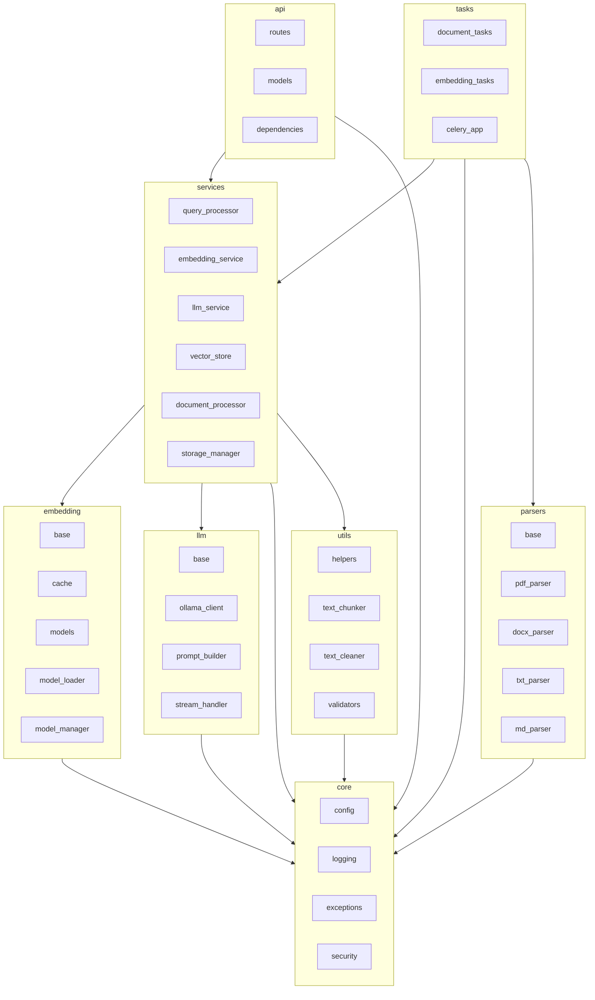

## Package Structure & Dependencies – Agentic RAG System

### 1. Overview

This document explains the **Python package layout** of the agentic RAG system and
how modules depend on each other. It is intended to help developers navigate the
codebase and understand where agent behaviours live.

The main application code is under `src/`, with the following top-level packages:

- `api` – FastAPI application, routes, and API models
- `services` – core business logic and orchestration services
- `tasks` – Celery task definitions and app wiring
- `core` – configuration, logging, security, exceptions
- `embedding` – embedding model abstractions, cache, and loaders
- `llm` – LLM client, prompt builder, streaming helpers
- `parsers` – document parsers for various formats
- `utils` – generic utilities (validation, chunking, text cleaning)

---

### 2. High-Level Dependency Graph

The following diagram shows the main package-level dependencies.

---

### 3. Package Responsibilities

#### 3.1 `api`

- Owns the FastAPI application and HTTP boundary.
- Main responsibilities:
  - Define request/response models in `api/models/*`.
  - Wire routes in `api/routes/*` to underlying services/agents.
  - Apply middleware for logging, rate limiting, and security.
- Should remain **thin**, delegating business logic to `services` and `tasks`.

#### 3.2 `services`

- Encapsulates business logic and orchestration.
- Examples:
  - `query_processor` – Query Orchestrator Agent core.
  - `embedding_service` – Embedding Agent core (uses `EmbeddingCache`).
  - `llm_service` – Answer / Model Agent core.
  - `vector_store` – Retrieval Agent core (Qdrant adapter).
  - `document_processor` and `storage_manager` – Ingestion Agent components.
- Services are designed to be:
  - **Re-usable** across API routes and Celery tasks.
  - **Testable** without HTTP or Celery wiring.

#### 3.3 `tasks`

- Contains Celery task definitions and the Celery app.
- Main files:
  - `celery_app.py` – configures Celery with `CeleryConfig`.
  - `document_tasks.py` – ingestion tasks.
  - `embedding_tasks.py` – embedding tasks.
- Tasks typically:
  - Deserialize task arguments.
  - Call into `services` for actual work.
  - Handle retries and logging around failures.

#### 3.4 `core`

- Cross-cutting infrastructure concerns:
  - `config` – configuration aggregation (`Config`, `get_config`).
  - `logging` / `loki_handler` – structured logging.
  - `exceptions` – shared error types and HTTP mapping.
  - `security` – JWT, auth-related helpers.
- All other packages depend on `core` for configuration and error types.

#### 3.5 `embedding`

- Embedding-specific infrastructure:
  - `base` – abstract embedding model interface.
  - `models/*` – concrete model implementations (e.g. Granite).
  - `cache` – `EmbeddingCache` implementation.
  - `model_loader`, `model_manager`, `startup` – model lifecycle helpers.
- Used almost exclusively by `EmbeddingService` and embedding-related tasks.

#### 3.6 `llm`

- LLM integration and prompt handling:
  - `ollama_client` – HTTP client for Ollama.
  - `prompt_builder` – prompt templates and assembly logic.
  - `base`, `stream_handler`, `templates/*` – abstractions for different LLMs and streaming.
- `LLMService` uses this package to implement Answer / Model Agent behaviour.

#### 3.7 `parsers`

- File-format specific parsing:
  - `base` – parser interface.
  - `pdf_parser`, `docx_parser`, `txt_parser`, `md_parser` – concrete parsers.
- Used by `DocumentProcessor` in the Ingestion Agent.

#### 3.8 `utils`

- Generic helper utilities:
  - `text_chunker` – chunking strategies.
  - `text_cleaner` – text normalisation.
  - `validators` – query and collection validators.
  - `helpers` – assorted utility functions.
- Intended to have **no knowledge of HTTP or Celery**.

---

### 4. Extending the Package Structure

When adding new agents or features:

- Prefer adding **new services** under `src/services/` and wiring them into:
  - API routes (`src/api/routes/*`) for synchronous behaviour.
  - Celery tasks (`src/tasks/*`) for asynchronous behaviour.
- Keep infrastructure concerns in `core` and re-use existing patterns for:
  - Configuration
  - Logging and error handling
- Add documentation updates referencing new modules in this file so the
  high-level picture stays accurate as the system evolves.

